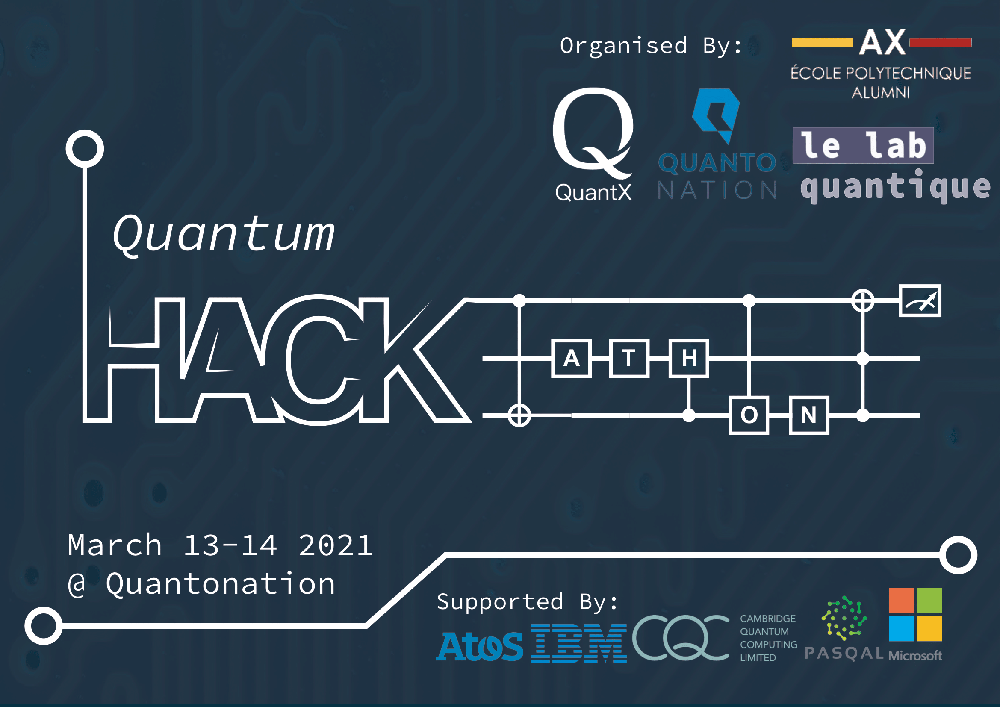

# Quantum Hackathon March 2021
Quantum hackathon of March 2021

Dear participants,
Welcome to the first Quantum Hackathon by QuantiX at Quantonation in Paris!
The event is supported by Pasqal, Atos, CQC, Microsoft and IBM, who kindly provided the quantum hardware and software platforms and also formulated the challenges for the Hackathon.

## Github
This GitHub contains the repositories with the computational challenges and introductory tutorials from each provider respectively on how to access and use the platforms.

## Slack
To ensure the efficient communication we also provide you with the access to a Hackathon’s Slack where you could find permanent technical support from providers and organisers. 
## Organization
The event take place on March 13-14 at Quantonation in Paris.

In order to respect the COVID-19 related restrictions, we ask you to bring a valid test on the first day of competition. We will distribute the masks and hydroalcoholic gels during both days.

<ins> Day 1: </ins>  	 
09:00 am - 09 :30 am 	-	Welcome breakfast, set up of the teams  
		09:30 am - 10:00 am 	- 	Introduction from the providers  
		10:00 am - 13:00 pm 	-	Competition  
		13:00 pm - 14:00 pm	-	Lunch break  
		14:00 pm - 17:00 pm	-	Competition  
		 

<ins> Day 2: </ins>	   
09:00 am - 09 :30 am 	-	Breakfast  
		09:30 am - 12:00 am 	- 	Competition  
		12:00 am - 12:30 pm 	-	Snack  
		12:30 am - 14:00 pm	- 	Competition  
		14:00 pm - 15:30 pm	- 	Presentation of results, feedbacks of providers  
		15:30 pm - 16:00 pm	-	Jury debrief  
		15:30 pm - 17:00 pm	-	Buffet  
		16:00 pm - 17:00 pm	- 	"Remise des prix", discussions with the participants and the providers  
		 

During all the event we will provide you with drinks and snacks. Please, communicate to us your dietary restrictions.

## Prize
Thanks to the support of Pasqal, Atos, CQC, the winning team will receive a 1500€ check.
The second best will be granted a 500€ check.
All the participants will have a unique opportunity to exchange with the providers on the career possibilities and potential to collaborate.

Good lucQ! 

Elvira and Alexandre, for QuantX
